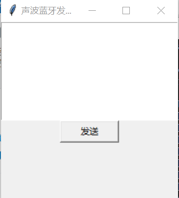
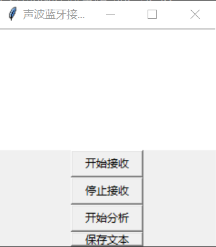
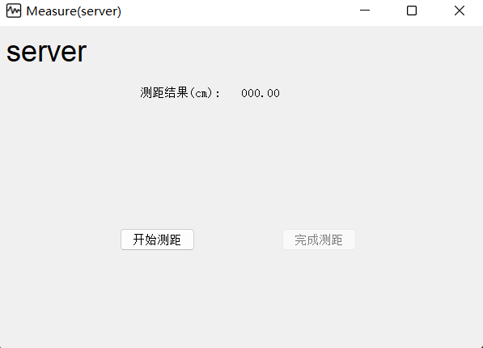
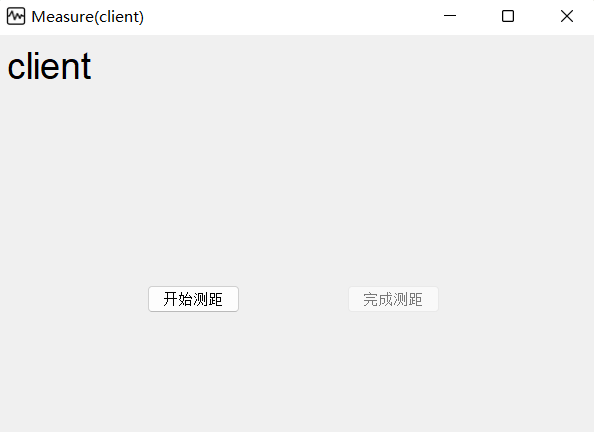

# README

## 一、蓝牙通信

首先在 `src/bluetooth` 文件夹下执行下面的命令，安装所需的依赖

```bash
pip install -r requirements.txt
```

然后设备A上运行蓝牙发送端，在 `src/bluetooth` 文件夹下执行如下命令，显示图形界面：

```bash
python sender_gui.py
```

 

然后设备B上运行蓝牙接收端，在 `src/bluetooth` 文件夹下执行如下代码，显示图形界面：

```
python reciever_gui.py
```

 

测试步骤为：

- 在发送端文本框中输入好想要传输的内容
- 在接收端点击开始接收
- 在发送端点击开始发送
- 待发送端信号发送完毕后，即不再产生声音时，在接收端点击停止接收
- 在接收端点击开始分析，分析得到的内容会呈现在对话框的文本框中
- 在接收端点击保存文本，会将分析得到的内容保存在该目录下test.txt文件中

## 二、声波测距

首先在 `src/distance` 文件夹下执行下面的命令，安装所需的依赖

```bash
pip install -r requirements.txt
```

然后设备A上运行服务器端，在 `src/distance` 文件夹下执行如下命令，显示图形界面：

```bash
python server.py
```

 

然后设备B上运行客户端，在 `src/distance` 文件夹下执行如下代码，显示图形界面：

```
python client.py
```

 

测试步骤为：

- client端点击开始测距
- server端点击开始测距
- 听见server端发出声音信号后在client端点击完成测距
- 听见client端发出声音信号后，等待client端分析并上传测量结果到云端服务器（大约5-10s），在server端点击完成测距
- 在server端将显示测量结果

注：client上传云端服务器完成的日志可以在client端的控制台查看，如果server端获取结果过早，会显示error